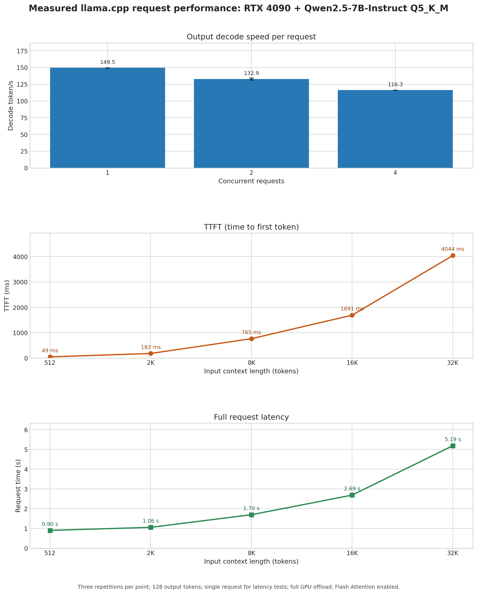

# llama.cpp + Qwen 7B 部署与性能实测报告

基础测速：2026-09-19；请求延迟复测：2026-09-20

## 1. 结论

本机已经完成 `llama.cpp + Qwen2.5-7B-Instruct Q5_K_M GGUF` 的 CUDA 部署。模型分片校验、命令行推理、OpenAI 兼容 API、1/2/4 路并发，以及单并发下 0-32K 实际上下文深度测试均已通过。

核心结果：

- 单请求 API decode 约为 **149.54 token/s**。
- `llama-bench` 在空 KV cache 下的纯 decode 为 **160.18 +/- 0.30 token/s**。
- 2 路并发时，每请求约 **132.95 token/s**。
- 4 路并发时，每请求约 **116.30 token/s**。
- 单并发的实际上下文深度从 0 增加到 32K 后，decode 从 **160.18** 降至 **117.80 token/s**，下降约 **26.5%**。
- 实际请求测试中，32K 输入的 TTFT 约 **4.04 s**，完整请求耗时约 **5.19 s**，输出 decode 约 **111.72 token/s**（固定生成 128 token）。
- 这张 RTX 4090 可以支持 Qwen 7B 并发；并发会降低单个请求的生成速度，因此单任务场景不应为了“支持并发”主动提高并发数。

本报告将部署侧的实际上下文上限固定为 **32K**。当前需求如果一次只处理一个科研任务，建议使用 **并发 1、默认上下文 8K，最大不超过 32K**。如果后续需要同时调度多个独立请求，可以再测试 2 路或 4 路，但应接受每个请求的速度下降。

## 2. 部署状态

| 项目 | 实际结果 |
|---|---|
| GPU | NVIDIA GeForce RTX 4090，24,564 MiB |
| NVIDIA Driver | 580.105.08 |
| CUDA Toolkit | 12.8.93 |
| llama.cpp | `0.4.1-dev`，源码压缩包构建 |
| CUDA 架构 | `sm_89` |
| 模型 | Qwen2.5-7B-Instruct |
| 参数量 | 7.62B |
| GGUF 量化 | Q5_K_M |
| GGUF 大小 | 5.07 GiB（双分片） |
| GPU offload | 全部模型层 |
| Flash Attention | 已启用 |
| 模型训练上下文元数据 | 131072 token |
| 部署侧上下文上限 | 32768 token |
| CLI 推理 | 通过，中文输出正常 |
| OpenAI 兼容 API | `/v1/chat/completions` 验证通过 |

安装路径：

```text
/root/autodl-tmp/llama.cpp
/root/autodl-tmp/llama.cpp/build/bin/llama-cli
/root/autodl-tmp/llama.cpp/build/bin/llama-bench
/root/autodl-tmp/llama.cpp/build/bin/llama-server
/root/autodl-tmp/models/qwen2.5-7b-instruct-gguf
```

模型分片 SHA256：

```text
42f6693004793ee6cf1b2b723f0273b10f86a3bb2a949bd9128d4cda5fb866cd
beba9d4f2f5a1fe7d144dcae332e68b52c26705c5310dece2e5d1997e091e134
```

## 3. 实测图



图按纵向排列，三个面板分别是：

- 顶部：并发数对**每个请求自身的输出 decode token/s**。
- 中部：单并发、输入上下文长度对 **TTFT（time to first token）** 的影响。
- 底部：单并发、固定生成 128 token 时的**完整请求耗时**。

上下文测试的输入 token 是按长度构造的性能测试 prompt，最大到 32K；这代表本报告采用的部署上限，不代表模型元数据的理论上限。

## 4. 并发对 token 速率的影响

测试条件：

- `llama-server` 配置为 4 个 slots，每个 slot 8K 上下文。
- 每个请求强制生成 256 token，避免因为提前输出 EOS 导致样本长度不同。
- 每个并发档位重复 3 次，表中为中位数。
- 关闭 prompt cache；全 GPU offload；Flash Attention 开启。
- 图中只保留每个请求的 decode 速度，因为当前目标是单任务返回时间。

| 同时请求数 | 每请求 decode | 相对单路 | 整组耗时 |
|---:|---:|---:|---:|
| 1 | 149.54 token/s | 基线 | 1.742 s |
| 2 | 132.95 token/s | -11.1% | 1.966 s |
| 4 | 116.30 token/s | -22.2% | 2.275 s |

### 4.1 如何理解

并发 2 时，每个请求慢约 11%；并发 4 时，每个请求慢约 22%。

如果任务目标是单个请求尽快返回，应该只看这张图中的每请求 decode 速度和下面的请求延迟。

因此：

- 只运行一个任务：使用 `-np 1`，单任务最快。
- 同时处理多个独立样本：`-np 2` 是延迟与吞吐的较好平衡。
- 只关心整批任务完成时间：可以使用 `-np 4`。
- 并发继续增加不一定继续线性增益，需要重新测试 GPU 饱和点和长上下文显存占用。

## 5. 单并发下上下文长度、TTFT 和完整请求耗时

以下数据来自 `llama-server` 的真实流式请求，而不是只用 `llama-bench` 的内核计时。每个请求固定生成 128 token，单并发、关闭 prompt cache，每个点重复 3 次取中位数。

- **TTFT**：客户端发起请求到收到第一个真实生成 token 的墙钟时间。
- **完整请求耗时**：客户端发起请求到收到结束事件的墙钟时间。
- **输出 decode token/s**：服务端对该次请求生成阶段的计时；它不包含 prompt prefill 时间。

| 输入上下文 | TTFT | 完整请求耗时 | 输出 decode |
|---:|---:|---:|---:|
| 512 | 48.5 ms | 0.90 s | 148.70 token/s |
| 2K | 182.4 ms | 1.06 s | 145.30 token/s |
| 8K | 765.0 ms | 1.70 s | 136.54 token/s |
| 16K | 1690.8 ms | 2.69 s | 127.30 token/s |
| 32K | 4043.6 ms | 5.19 s | 111.72 token/s |

完整请求耗时约等于 TTFT 加上生成阶段耗时。以 32K 为例，TTFT 约 4.04 秒，生成 128 token 的阶段约 1.15 秒，总计约 5.19 秒。

对当前模型，可以用以下数值做单请求耗时的初始估算：

| 任务所处上下文 | 预计 decode 速度 |
|---:|---:|
| 短上下文 | 约 150-160 token/s |
| 8K 附近 | 约 145 token/s |
| 16K 附近 | 约 135 token/s |
| 32K 附近 | 约 118 token/s |

这里的上下文长度是实际输入长度。仅仅将服务启动参数设置为 `-c 32768`，但实际只输入几百 token，并不会立刻产生 32K 对应的 TTFT 和完整请求耗时。

本报告后续统一以 **32K 作为部署上限**，不再把 64K/128K 纳入当前方案的性能承诺。

## 6. 上下文显存占用

此前的 CUDA 内存分解测试结果如下：

| 上下文上限 | 模型 | KV cache | Compute | llama.cpp `self` 合计 |
|---:|---:|---:|---:|---:|
| 8K | 4829 MiB | 448 MiB | 140 MiB | 5417 MiB |
| 16K | 4829 MiB | 896 MiB | 148 MiB | 5873 MiB |
| 32K | 4829 MiB | 1792 MiB | 164 MiB | 6785 MiB |

单路 32K 在 24 GB 显存上仍有较大空间。并发服务中 `-c` 是 server 的总上下文池；如果希望每个 slot 都有 8K，应按并发数放大：

```text
-np 1 -> -c 8192
-np 2 -> -c 16384
-np 4 -> -c 32768
```

## 7. 推荐启动方式

单任务、速度优先：

```bash
cd /root/autodl-tmp/llama.cpp

LD_LIBRARY_PATH=/root/autodl-tmp/llama.cpp/build/bin \
./build/bin/llama-server \
  -m /root/autodl-tmp/models/qwen2.5-7b-instruct-gguf/qwen2.5-7b-instruct-q5_k_m-00001-of-00002.gguf \
  -a qwen2.5-7b-instruct \
  -ngl all \
  -fa on \
  -c 8192 \
  -b 2048 \
  -ub 512 \
  -np 1 \
  --host 127.0.0.1 \
  --port 8080 \
  --no-ui
```

需要同时调度多个独立请求时，可以把参数调整为：

```text
-np 2 -c 16384
```

或者：

```text
-np 4 -c 32768
```

## 8. 复现测试

上下文深度测试：

```bash
LD_LIBRARY_PATH=/root/autodl-tmp/llama.cpp/build/bin \
/root/autodl-tmp/llama.cpp/build/bin/llama-bench \
  -m /root/autodl-tmp/models/qwen2.5-7b-instruct-gguf/qwen2.5-7b-instruct-q5_k_m-00001-of-00002.gguf \
  -p 512 \
  -n 128 \
  -d 0,512,2048,8192,16384,32768 \
  -r 3 \
  -ngl 99 \
  -fa on \
  -b 2048 \
  -ub 512 \
  -t 16 \
  -o json
```

并发测试脚本：

```bash
python /root/autodl-tmp/benchmarks/qwen2.5-7b-llamacpp-20260919/benchmark_concurrency.py \
  --url http://127.0.0.1:8081/v1/chat/completions \
  --model qwen2.5-7b-instruct \
  --concurrency 1,2,4 \
  --repetitions 3 \
  --max-tokens 256
```

## 9. 测试文件

```text
benchmarks/qwen2.5-7b-llamacpp-20260919/
├── benchmark_concurrency.py
├── generate_report_assets.py
├── concurrency_raw.json
├── concurrency_summary.csv
├── context_depth_raw.json
├── context_depth_summary.csv
├── request_latency_raw.json
├── request_latency_summary.csv
├── benchmark_request_latency.py
├── qwen2.5-7b-llamacpp-throughput.png
└── qwen2.5-7b-llamacpp-throughput.svg
```

原始 JSON 保留了每轮数据，CSV 用于后续分析，PNG/SVG 用于报告和展示。当前测试服务已经停止，不占用 GPU。

## 10. 限制

- 每个测试点只有 3 次重复，适合判断趋势，不应直接当作严格的生产 SLO。
- `llama-bench` 不计 tokenizer 和采样时间；HTTP 并发测试包含请求调度和少量接口开销。
- 本次最高测试到 32K 实际上下文，没有对 64K/128K 的速度、显存和长上下文输出质量下结论。
- 不同 prompt 长度、输出长度、采样参数和 llama.cpp 版本都会改变结果。
- 本次结果只适用于当前 RTX 4090、Q5_K_M 文件和当前 CUDA 构建。
