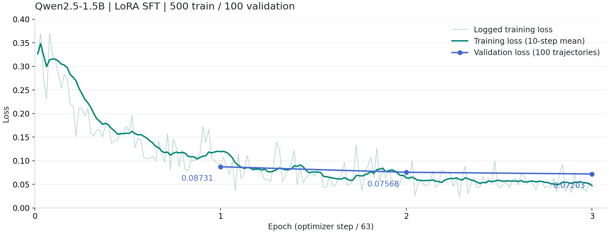

# 1.5B SFT训练复盘：数据、方法、日志与调整

日期：2026-10-05，时间统一使用Asia/Shanghai。本文件总结已经完成的训练；四个模型的自主环境评测另见`18_1.5B_SFT四模型效果_固定200条测试.md`。以下数字来自实际运行产物，不是设计方案中的预估。

## 1 已经完成什么

```text
已有Qwen2.5-1.5B-Instruct HF基座
  + 500条训练轨迹 / 100条验证轨迹
  -> LoRA SFT，连续3个epoch
  -> 189次优化器更新
  -> checkpoint-63 / checkpoint-126 / checkpoint-189
  -> 按验证loss选择checkpoint-189
  -> 另存selected_adapter，原来的三个checkpoint全部保留
```

训练状态记录从2026-10-05 02:06:02到02:13:57，端到端475.557秒，约7分55.6秒。Trainer调用包含训练、逐epoch验证与保存，用时467.209秒；这两个计时范围不同，不能混成同一个数字。初期根据约2.4秒一次更新估算总共8至10分钟，实际结果接近8分钟。

此次是已有Instruct模型的监督微调，没有执行GRPO、重新预训练、GGUF训练或全参数更新。200条测试任务没有参与参数更新，也没有参与三个epoch的验证loss计算；训练完成后才启动四模型环境对照。

## 2 数据怎么变成训练样本

原始来源是`new_demo/runs/quota200_20261004_v2/data_processed/D_dataset.jsonl`，总计1000条、每类200条。六条T4轨迹曾尝试越界动作，然后恢复为正确拒绝；第一轮行为模仿没有把这些错误动作当正例，排除`sc_T4_016/041/052/077/151/201`后，得到994条无错误成功候选。

```text
1000条已有成功轨迹
  -> 排除6条带错误尝试的恢复轨迹
  -> 994条候选
  -> 同家庭状态与同任务目标分组、按类选样、固定种子20261005
  -> 500训练 / 100验证 / 200测试 / 194备用
```

| 集合 | T1 | T2 | T3 | T4 | T5 | 总数 | 输入token总数 | 监督token总数 | 最长输入 |
|---|---:|---:|---:|---:|---:|---:|---:|---:|---:|
| 训练 | 100 | 100 | 100 | 100 | 100 | 500 | 925656 | 73875 | 2689 |
| 验证 | 20 | 20 | 20 | 20 | 20 | 100 | 185349 | 15015 | 2696 |
| 测试 | 40 | 40 | 40 | 40 | 40 | 200 | 372802 | 30086 | 2695 |
| 备用 | 40 | 40 | 40 | 34 | 40 | 194 | 360791 | 29022 | 2632 |

分组指纹包含家庭状态与任务目标，忽略运行编号和intent措辞，并统一数组顺序；四个集合的组id互斥。设备、动作、方向算子、keep和拒绝原因覆盖优先补到训练集合，再随机补满。它没有实现“房屋模板全部不同”或“所有口语都未见过”：训练集合447种用户请求文本，测试集合189种，两者共享25种完全相同的请求文本，但对应的场景组不同。因此这轮检验的是同一合成分布下不同场景的表现，不能直接当成陌生领域或完全新语言的泛化证明。

一整条对话是一条训练样本，没有把各轮独立打散到不同集合，也没有丢掉工具回执。500条训练轨迹里共有2790次assistant决策，其中T1为510、T2为889、T3为613、T4为400、T5为378。每次assistant输出都参与监督，三遍epoch合计访问1500条轨迹、8370个assistant输出段；这不等于进行了8370次优化器更新。

```text
system：A_policy全文 + 公开工具表
user：用户原话
assistant：{"name":"observe_home","arguments":{}}
user：observation: 真实工具回执
assistant：下一条工具调用
...
assistant：finish的JSON

loss范围
  assistant JSON正文及im_end -> 真实token标签
  system、user、observation、角色头、padding -> -100
```

隐藏task、整屋初始状态真值、最终状态真值不作为模型输入。A可以通过工具逐步看到局部状态；评测器读取隐藏信息仅用于判断。assistant目标由记录中的工具调用重建为规范JSON，不照搬教师可能使用的markdown围栏或额外说明。

## 3 提示词与few-shot口径

历史千条批次提交是`d98b38f`。核查发现，D2出题与请求生成、D3审核、D6复核的模板包含小例子和完整例子；D5执行轨迹使用`DeepSeekPolicy`，读取另一份A专用提示词。A提示词也含JSON输出格式和拒绝行为示例，例如：

```text
目标超出这台设备的能力：先 inspect 到范围，再一次 finish
finish 写 {"summary":"为什么做不到","outcome":"refused",
          "reason_code":"OUT_OF_SAFE_RANGE"}
```

本轮训练保留这份A提示词的全部内容，工具表也保留。实际500条训练记录的system，500/500与历史模板填入对应工具表后的文本逐字一致；首次user也500/500等于原始请求。历史模板与当前文件一致，SHA-256为`b675fa59dea3a15cb5765667383360e5d6c68e9a661571226d8126e67b8dd976`。

这里需要用准确说法：没有额外拼接`FewShotPolicy`的多轮示范对话，但提示词内已有例子并未删除。代码中的`few_shot=false`指前者，不表示system完全没有示例。D2的完整出题示例不直接塞给A；旧的小模型“11版few-shot评测”另外插入类别示范、包装真实请求，并采用12轮上限，不能与本轮10轮、HF推理的结果视为同条件比较。

历史完整HTTP请求没有保存在当前服务器，提示词核对依据是对应版本的代码与模板、实际训练消息。不能将这次核对夸大为逐个原始网络请求的复核。

## 4 实际训练方法

使用RTX 5090单卡，设备总显存32607 MiB。Python环境为`/root/autodl-tmp/sft-venv`，继承已有PyTorch/CUDA，没有重新下载训练用CUDA分发包。

| 项目 | 实际配置 |
|---|---|
| 模型 | 本地Qwen2.5-1.5B-Instruct HF权重 |
| 框架 | PyTorch 2.8.0+cu128、Transformers 4.57.3、TRL 0.24.0、PEFT 0.18.0 |
| 训练入口 | TRL SFTTrainer，采用官方Trainer更新循环 |
| 可训练参数 | 18464768个LoRA参数，基座冻结 |
| LoRA | r=16、alpha=32、dropout=0.05、bias=none |
| 作用层 | q/k/v/o_proj及gate/up/down_proj |
| 精度与注意力 | BF16基座、SDPA、TF32允许；非重入gradient checkpointing |
| 优化器 | adamw_torch，初始学习率1e-4，最大梯度范数1 |
| 调度 | linear，warmup_ratio=0.1，即19次更新的warmup |
| Batch | 每次4条轨迹，梯度累计2次，正常有效batch=8 |
| 长度 | max_length=3072，动态padding到8的倍数，禁止截断 |
| 数据处理 | 已有正确labels进入官方collator，跳过Trainer重复预处理 |
| Packing | 关闭，不把多个独立轨迹拼成同一序列 |
| 混合方式 | T1到T5同一Dataset，每epoch重排，无T1先训完再训T5 |
| 验证与保存 | 每epoch验证loss并完整保存；不轮换删除历史checkpoint |

每epoch500条，micro-batch为4，得到125个微批次，按累计2次得到63次优化器更新；最后一次仅4条。三个epoch共189次更新。训练的一遍输入为925656 tokens，三遍合计2776968 tokens，与日志中的最终num_tokens一致。

`TRAIN_TEMPLATE`只给assistant区域增加generation标记，编码前逐条检查它与Qwen原始模板渲染文本一致；再逐段检查监督正文与JSON目标、结束token完全对应。输入超长直接失败，不能为了容量把最后的finish删掉。

## 5 日志和检查点实际结果

| Epoch | 优化器step范围 | 逐step日志loss算术均值 | 最后一个step loss | 100条验证loss | 验证token accuracy | 验证用时 |
|---|---|---:|---:|---:|---:|---:|
| 1 | 1到63 | 0.168494 | 0.0929 | 0.08731062 | 97.2115% | 7.3309秒 |
| 2 | 64到126 | 0.074962 | 0.0692 | 0.07568157 | 97.5489% | 7.3697秒 |
| 3 | 127到189 | 0.055632 | 0.0510 | 0.07202742 | 97.5387% | 7.2955秒 |

逐step均值是63条已舍入日志的算术均值，不是重新按全体监督token加权计算的epoch损失。Trainer给出的全程training_loss为0.09969730。189条训练日志、3条验证日志和1条总训练统计，共193条指标记录；原始文件仍保留，文档没有用少数截取点替代全部日志。



图中浅线是实际逐step训练loss，深线是10个step的移动算术均值，蓝色点是三个epoch的验证loss。第一个记录loss为0.3269，最后为0.0510；中间有波动，原因至少包括不同任务、不同批次、不同监督token数量，不能要求每一步单调下降。

验证loss从epoch1到epoch2下降约13.32%，从epoch2到epoch3下降约4.83%，改善幅度收窄。第三个epoch的验证loss最低，选择checkpoint-189符合预先规定；验证token accuracy却比epoch2略低，差约0.0102个百分点。两种指标不能互相替代，更不能将约97.5%的教师强制token accuracy解释成自主任务成功率。

```text
每epoch完整checkpoint
  adapter_model.safetensors、adapter_config.json
  optimizer.pt、scheduler.pt、rng_state.pth
  trainer_state.json、training_args.bin、tokenizer文件
  checkpoint_index.json登记epoch、step与配置/数据/adapter校验值

训练结束
  selected_adapter：验证最优adapter与tokenizer的副本
  training_summary.json：训练摘要及完整log_history
  training_status.json：最终完成状态
  metrics.jsonl：每step与每epoch指标
```

每份adapter文件73911112字节，约70.49 MiB，包含392个F32张量；BF16基座与保存的FP32 LoRA参数是两种不同口径。每份optimizer.pt为148048187字节，约141.19 MiB。没有逐epoch复制整个基础模型。selected_adapter不含恢复所需的完整优化器状态，接续训练应使用相应checkpoint目录。

再次核对基础权重SHA-256为`dd924a11b4c220f385b51ffa522daea7c9f3d850e31b162bb5661df483c6d3ee`，与下载登记时一致。selected_adapter和checkpoint-189的adapter文件SHA-256同为`fce4053b565348f9d266dbb3fa52b2eaba37f57b5ad821b4f705c14e1a3ad274`，证实它是第三个epoch的选定副本。

实际分配峰值22971.5 MiB，约22.43 GiB；缓存分配器预留峰值29760 MiB，约29.06 GiB。两者不相加。页面末尾显示的“当前预留显存”与全过程预留峰值也不是同一项；完整峰值以training_summary为准，不能继续沿用两条轨迹冒烟的12.74 GiB估计。

## 6 调整和工程处理经过

```text
早期分析：600到700条候选规模
  -> 用户确定500训练、100验证、200测试
  -> 初始保守micro2 × 累计4，有效batch8
  -> 两条最长轨迹、两次更新的GPU冒烟
  -> 用户要求micro4 × 累计2，仍为有效batch8
  -> 重新登记配置版本，确认全部划分JSONL内容SHA-256不变
  -> 用户批准后直接正式训练，没有另跑GPU压力测试
```

改batch时没有改学习率、LoRA、监督mask、训练样本或epoch数，也没有根据测试效果调参。旧manifest备份在仓库外version_history；旧2条轨迹冒烟保留为历史证据，不能称为新4×2的实测验证。

预测试阶段修复过smoke模式变量问题。另一次检查发现，向已有PEFT模型追加加载多个adapter会经过FP32到BF16的中间转换，造成参数不能逐张量零误差比较；最终改为每个checkpoint独立加载新的基座与adapter，未通过放宽误差掩盖问题。正式评测也沿用独立加载路径。

训练与页面通过`launch.py`运行在不同Linux会话中，标准输入断开、日志独立落盘。训练PID为97835，启动后PPID为1、SID与PID相同；训练已自然结束，不依赖对话持续连接。每个优化器step写进度、loss和学习率，页面6008每3秒只读刷新，不能在页面发起训练。实例关机仍会停止进程，不能将脱离SSH等同于关机保活。

准备和监控代码原有123项自动测试通过，补审入口另有6项无网络回归，本次合计129项。正式运行完成了3个epoch、189次更新与三份完整checkpoint，无训练异常；这与“真实中断后恢复训练已验证”不同，本轮没有做中断恢复实验。

训练完成后，四个模型在固定200条测试任务上各跑一次，自主交互共800条，本地generate共4285次，生成异常为0。随后用户配置根目录DeepSeek密钥，使用review.py对310条C通过的T3/T4/T5补原D6三票，100并发上限下完成930次调用，用时9.567秒，无系统失败。这个阶段没有重新生成轨迹、没有参数更新，最终完整成功率为基线0%、epoch1为72.5%、epoch2为84.5%、epoch3为88%。分类结果、语义错误与安全过程指标放在第18篇，不把它们当作训练loss。

## 7 文件职责与复现边界

```text
common.py：配置、校验值、原子文件与同名中文说明
data.py：筛选、分组、消息重建、标签、manifest核验
train.py：官方训练循环、epoch验证保存、恢复确认入口
progress.py：训练独写状态和指标
launch.py：独立会话及PID/日志
monitor.py / dashboard.html：只读页面
evaluate.py：本地模型产生动作，复用A/C/B进行真实交互
review.py：并发补审已有轨迹的D6三票，缓存与原始轨迹分开保存
preflight.py / test_pipeline.py / test_monitor.py：准备与工程验证
test_review.py：无网络测试D6补审、确认开关与中断缓存
```

代码在`training/10-5_sft/`，模型和较大运行产物留在仓库外。实际配置见`sft-main/run_config.json`，不是仅凭后来可能修改的config.json推断。数据版本见`data/manifest.json`；epoch索引见`sft-main/checkpoint_index.json`。

```text
基础模型：/root/autodl-tmp/models/Qwen2.5-1.5B-Instruct/hf/
训练产物：/root/autodl-tmp/training_runs/10-5_sft/sft-main/
原始训练stdout：/root/autodl-tmp/training_runs/10-5_sft/services/train.log
逐step指标：sft-main/metrics.jsonl
汇总与状态：sft-main/training_summary.json、training_status.json
历史准备证据：training/10-5_sft/reports/preflight_report.json
四模型测试轨迹：training_runs/10-5_sft/comparison_test_20261005/
```

本轮训练池的T4没有READ_ONLY_DEVICE拒绝示范，只有OUT_OF_SAFE_RANGE；测试同样来自这份候选池，不能证明只读设备拒绝已经学好。数据来自成功轨迹筛选，错误恢复行为没有被系统训练。这些覆盖限制保留在效果解释中，不能凭下降的loss消除。
