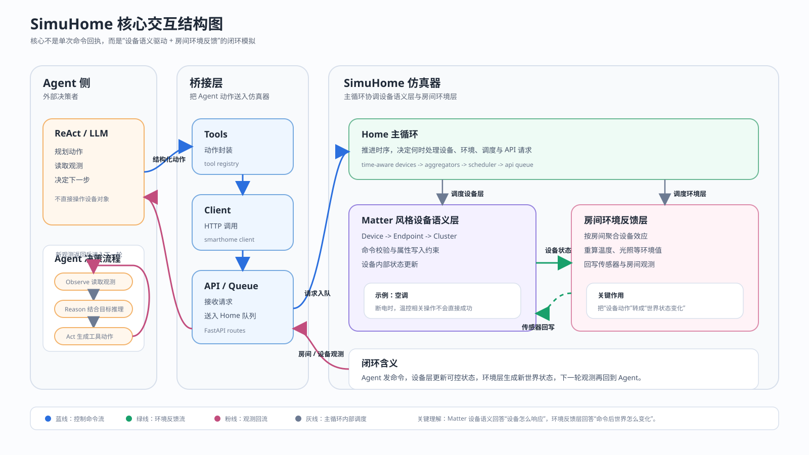

# SimuHome 分析总览

这份 README 不是把已有分析文档再缩写一遍，而是把最核心的结构图、对应代码锚点、以及这些代码所代表的系统含义压到同一份总纲里。

如果只保留一句话来概括 SimuHome，可以写成：

```text
SimuHome
= Agent 驱动的智能家居任务环境
= Matter 风格设备语义层
+ Home 主循环
+ 房间级环境反馈层
```

它真正模拟的不是“命令有没有返回成功”，而是：

```text
Agent 看到世界
-> Agent 产生命令
-> 设备按 Matter 风格语义更新自身状态
-> 房间环境根据设备状态演化
-> 新世界状态再返回给 Agent
```

## 核心结构图



图文件：
[SimuHome核心交互结构图.svg](/d:/D_coderesource/simuhome/analysis_docs/SimuHome核心交互结构图.svg)

---

## 总体链路

先不要陷进文件细节，先看整个系统最本质的一条链：

```text
Agent
  Observe -> Reason -> Act
        |
        v
Tools / Client / API
        |
        v
Home Simulation Loop
        |
        +--> Device Semantic Layer
        |       Device -> Endpoint -> Cluster
        |       validate -> update device state
        |
        +--> Room Environment Layer
                read device state
                -> aggregate room effects
                -> write back sensor attributes
        |
        v
new room state / device state / sensor value
        |
        v
Agent enters next round
```

这条链里最重要的不是“谁调用了谁”，而是两个分工：

```text
Device Semantic Layer
回答：设备怎样响应命令

Room Environment Layer
回答：命令之后世界怎样变化
```

也正因为这两个问题被拆开了，SimuHome 才不是一个简单的设备接口 mock。

---

## 1. Agent 侧：不是一句 “ReAct”，而是一轮轮闭环决策

左侧图块如果只写 `ReAct / LLM`，容易让人误以为这里只是一个标签。实际上，它在项目里的含义更接近下面这段：

```text
Observe
  读取当前房间状态、设备状态、上一轮执行结果
      |
      v
Reason
  结合任务目标判断下一步该做什么
      |
      v
Act
  生成结构化工具调用
      |
      v
Wait for new observation
      |
      └────────────> 回到 Observe
```

这里的重点不是“三个词”，而是：

```text
它不是一次性规划完全部动作，
而是每得到一次环境反馈，就重新决定下一步。
```

这和 SimuHome 的设计刚好对上，因为右侧系统返回给它的不是一句 “success”，而是新的世界状态。

从代码上看，Agent 侧的动作不是自然语言命令，而是工具层允许的结构化调用。相关锚点在：

- [react_agent.py](/d:/D_coderesource/simuhome/Simuhome_experiment/src/agents/strategies/react_agent.py:43)
- [tools.py](/d:/D_coderesource/simuhome/Simuhome_experiment/src/agents/tools.py:472)

如果把这一层再压缩成一句话，它其实是在做：

```text
基于环境反馈滚动更新的控制决策
```

---

## 2. 桥接层：不是业务逻辑，而是系统边界

中间这一层最容易被忽略，因为它看起来像“普通工程胶水”。但它其实承担了很重要的系统角色：

```text
Agent 不能直接改设备对象
Agent 只能通过统一入口进入仿真器
```

也就是说，这里不是随便转发请求，而是在维护系统边界。

把这层拆成图，会更好理解：

```text
Agent action
   |
   v
Tool Registry
   把动作组织成标准工具调用
   |
   v
SmartHomeClient
   把工具调用变成 HTTP 请求
   |
   v
FastAPI Routes
   把外部请求送入 Home 的 API queue
```

对应代码锚点：

- [tools.py](/d:/D_coderesource/simuhome/Simuhome_experiment/src/agents/tools.py:472)
- [smarthome_client.py](/d:/D_coderesource/simuhome/Simuhome_experiment/src/clients/smarthome_client.py:39)
- [routes.py](/d:/D_coderesource/simuhome/Simuhome_experiment/src/simulator/api/routes.py:33)

这层最值得强调的一点是：

```text
控制动作一旦进入 API queue，
它就不再是“立刻改值”，
而是进入仿真器自己的时序框架。
```

也就是说，中间层的意义不是通信本身，而是把外部动作纳入仿真时间。

---

## 3. Home 主循环：整个系统真正的中枢

如果问这个项目最核心的代码在哪，答案不是某个设备类，而是 `Home` 的主循环。

原因很简单。设备类只定义“一个设备能做什么”，但真正决定“世界怎么推进”的是 `Home`。

这段代码几乎可以直接当作系统骨架来读：

```python
while self.is_running:
    self.__process_time_aware_devices()
    self.__process_aggregators()
    self.__process_schedular_queue()
    self.__process_api_queue()
```

代码位置：
[home.py](/d:/D_coderesource/simuhome/Simuhome_experiment/src/simulator/domain/home.py:173)

如果把这 4 步翻译成结构图，它的含义是：

```text
tick start
   |
   +--> process time-aware devices
   |     先推进那些会随时间变化的设备内部过程
   |
   +--> process aggregators
   |     再根据最新设备状态重算房间环境
   |
   +--> process scheduler queue
   |     再检查有没有到时应触发的任务
   |
   +--> process api queue
   |     最后处理这一轮进入系统的外部请求
   |
   v
next tick
```

这一顺序非常关键，因为它回答了一个很多人会默认搞错的问题：

```text
命令发出后，并不是“整个世界立刻同步改完”。
```

更准确的过程是：

```text
设备先更新自己的可控状态
-> 环境层随后读取这些状态
-> 环境结果再反映成新的传感器值和房间观测
-> Agent 下一轮看到新的世界
```

因此 `Home` 的本质不是“保存房间和设备的容器”，而是：

```text
仿真时钟
+ 调度器
+ 所有状态更新的统一收口点
```

---

## 4. 设备语义层：Matter 风格的设备建模骨架

如果只看图上的名字，这一层写成了：

```text
Device -> Endpoint -> Cluster
```

这并不是为了形式上模仿 Matter，而是因为项目确实把设备能力组织成了 Matter 风格的应用层语义。

用空调设备这段代码做例子，能最直观地看出来：

```python
self.add_cluster(1, OnOffCluster())
self.add_cluster(1, ThermostatCluster())
self.add_cluster(1, FanControlCluster())
```

代码位置：
[air_conditioner.py](/d:/D_coderesource/simuhome/Simuhome_experiment/src/simulator/domain/devices/air_conditioner.py:23)

这三行代码已经很能说明问题了。它不是把空调写成一个“大状态枚举”，而是把空调拆成几个能力单元：

```text
OnOff
  表示电源控制能力

Thermostat
  表示温控相关能力

FanControl
  表示风量或风速相关能力
```

这正是 Matter 风格建模的味道：  
不是围着“设备外壳”建模，而是围着“能力组件”建模。

进一步看 cluster 基类，就能看出“驱动成功”到底是什么意思：

```python
def execute_command(self, command_id: str, **args) -> Result:
    if command_id not in self.commands:
        return Result.fail(...)
    ...
    result = command_func(**args)
    ...
    return Result.ok(...)
```

以及：

```python
def write_attribute(self, attribute_id: str, value: Any) -> Result:
    if attribute_id not in self.attributes:
        return ResultBuilder.attribute_not_found(...)
    if attribute_id in self.readonly_attributes:
        return Result.fail(...)
    self.attributes[attribute_id] = value
    return Result.ok(...)
```

代码位置：
[clusters/base.py](/d:/D_coderesource/simuhome/Simuhome_experiment/src/simulator/domain/clusters/base.py:14)

把这段逻辑压成一张小图，就是：

```text
command / attribute write enters cluster
        |
        v
path exists?
        |
        +-- no  -> fail
        |
        +-- yes
              |
              v
constraint satisfied?
              |
              +-- no  -> fail
              |
              +-- yes
                    |
                    v
update cluster state
                    |
                    v
return Result.ok(...)
```

所以这里的“成功”不是：

```text
像 Matter 指令就算成功
```

而是：

```text
路径合法
+ cluster 支持该能力
+ 参数与约束通过
+ 当前设备状态允许执行
+ 状态更新成功
```

空调设备里还有一个很典型的约束例子：

```python
power_status = self.get_attribute(1, "OnOff", "OnOff")
if not power_status:
    return Result.fail(
        ErrorCode.DEPENDENCY_VIOLATION,
        "Power dependency violation",
        "Cannot perform operation when power is OFF. Turn on the air conditioner first.",
    )
```

这段代码说明一个更重要的事实：

```text
设备不是收到命令就机械改值，
而是先检查设备语义上的依赖关系。
```

也因此，这一层最好理解成：

```text
受约束的能力模型
```

而不是一个统一的大状态机。

---

## 5. 环境反馈层：把设备动作翻译成世界状态变化

这部分是 SimuHome 最不像“普通接口模拟器”的地方。

如果系统只做到设备语义层，那么它最多回答：

```text
空调开没开
灯亮没亮
窗帘关没关
```

但智能家居 agent 真正要完成的任务，通常关心的是：

```text
房间有没有变凉
光照有没有变暗
空气有没有变好
```

所以项目在设备层之上，又加了一层房间环境反馈。

这层的结构应该理解成：

```text
room
  |
  +--> devices
  |
  +--> aggregators
         temperature
         humidity
         illuminance
         pm10
```

它的工作方式不是“设备自己改自己的环境值”，而是：

```text
device states
   |
   v
aggregator reads states
   |
   v
room environment is recomputed
   |
   v
sensor attributes are written back
```

温度聚合器里有一段非常能说明问题的代码：

```python
def sync_environment_to_devices(self):
    for device in self.monitored_devices.values():
        self.sync_device_sensor_from_env(device)

def sync_device_sensor_from_env(self, device):
    thermostat_endpoint = self._get_thermostat_endpoint(device)
    if thermostat_endpoint is None:
        return
    thermostat = device.endpoints[thermostat_endpoint].get("Thermostat")
    if thermostat:
        thermostat.attributes["LocalTemperature"] = int(self.current_value)
```

代码位置：
[temperature.py](/d:/D_coderesource/simuhome/Simuhome_experiment/src/simulator/domain/aggregators/temperature.py:268)

这段代码非常关键，因为它清楚地表明：

```text
房间温度不是 Agent 直接写进去的
房间温度也不是设备自己随便改的
而是聚合器计算完环境之后，再回写到设备传感属性中
```

于是整条环境链就很清楚了：

```text
空调开启
-> 空调 cluster 状态变化
-> 温度聚合器读取空调当前状态
-> 房间温度 current_value 变化
-> LocalTemperature 被同步回设备属性
-> Agent 下一轮读到新的温度
```

所以这一层的本质不是“又一组属性”，而是：

```text
把设备状态变化提升为房间级世界状态变化
```

---

## 6. 为什么这张图和这份 README 可以作为总纲

如果站在建模层面往回看，整个 SimuHome 其实就可以被压缩成下面这个总图：

```text
Agent decides
    |
    v
Bridge admits action into simulator time
    |
    v
Home loop advances one tick
    |
    +--> Device layer answers:
    |       "how does the device respond?"
    |
    +--> Environment layer answers:
            "how does the world change?"
    |
    v
new observation returns to Agent
```

所以这份总纲真正想帮你抓住的不是零散知识点，而是两个最硬的结论：

```text
结论一
SimuHome 的设备不是随便写几个设备类，
而是借用了 Matter 风格的设备语义骨架。

结论二
SimuHome 的仿真目标不是返回一次命令结果，
而是持续生成可观察、可反馈、可再决策的世界状态闭环。
```

如果未来要让模型快速理解这个项目，最值得先喂给它的不是长篇文件细节，而正是这份图加这份总纲。

---

## 延伸阅读

如果需要继续下钻，再看下面几份文档会更合适：

[SimuHome模拟机制梳理.md](/d:/D_coderesource/simuhome/analysis_docs/SimuHome模拟机制梳理.md)  
[SimuHome设备建模机制梳理.md](/d:/D_coderesource/simuhome/analysis_docs/SimuHome设备建模机制梳理.md)  
[从Matter到SimuHome的映射梳理.md](/d:/D_coderesource/simuhome/analysis_docs/从Matter到SimuHome的映射梳理.md)

如果只想保留一段最短摘要，可以直接引用：

```text
SimuHome 的核心不是“设备命令能不能执行”，
而是“Agent 动作如何通过 Matter 风格设备语义层进入系统，
再由房间环境反馈层把设备状态变化演化成新的世界状态，
最后把这个新世界重新返回给 Agent”。
```
